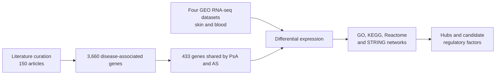

# Inflammatory spondyloarthropathies
Scripts and pipelines to analyze DEGs in inflammatory spondyloarthropathies.

# Beyond the Shared Inflammatory Axis: Differentiating Molecular Signatures in Psoriatic Arthritis and Ankylosing Spondylitis through Integrated Omics

# Integrated transcriptomics of psoriatic arthritis and ankylosing spondylitis

[](https://www.r-project.org/)
[](https://bioconductor.org/)
[](LICENSE)
[](https://doi.org/10.1101/2025.08.20.671331)

Research compendium for the study:

> **Beyond the Shared Inflammatory Axis: Differentiating Molecular Signatures in Psoriatic Arthritis and Ankylosing Spondylitis through Integrated Omics**

This repository contains the R analysis scripts, rendered reports, supplementary
tables, and result figures used to compare **psoriatic arthritis (PsA)** and
**ankylosing spondylitis (AS)** across skin and peripheral-blood transcriptomes.
The study combines literature-guided gene curation, differential expression,
functional enrichment, protein–protein interaction networks, and transcriptional
regulatory analysis.

## Study question

PsA and AS share inflammatory pathways and clinical features, but their tissue-
specific regulatory programs remain incompletely resolved. We therefore asked:

> Which molecular signals are shared by PsA and AS, and which expression and
> regulatory features distinguish the diseases across skin and blood?

## Study design



All differential-expression results reported in the study were evaluated using
an adjusted *P* value below 0.05 and an absolute log2 fold change of at least 1,
unless otherwise stated.

## Data sources and comparisons

All transcriptomic datasets are publicly available from the NCBI Gene Expression
Omnibus (GEO). No controlled-access patient-level data are stored in this
repository.

| GEO accession | Biological material | Groups and principal comparisons | Script | Rendered analysis |
|---|---|---|---|---|
| [GSE117769](https://www.ncbi.nlm.nih.gov/geo/query/acc.cgi?acc=GSE117769) | Peripheral blood | PsA, AS, and healthy controls | [R script](Codes%20in%20R/GSE117769_codigo.R) | [HTML report](html/Analysis-of-DataSet-GSE117769.html) |
| [GSE186063](https://www.ncbi.nlm.nih.gov/geo/query/acc.cgi?acc=GSE186063) | Skin | Non-lesional PsA, lesional PsA, and AS skin | [R script](Codes%20in%20R/GSE186063_codigo.R) | [HTML report](html/Analysis%20of%20DataSet%20GSE186063.html) |
| [GSE205748](https://www.ncbi.nlm.nih.gov/geo/query/acc.cgi?acc=GSE205748) | Skin | Non-lesional PsA, lesional PsA, and controls | [R script](Codes%20in%20R/GSE205748_codigo.R) | [HTML report](html/Analysis-of-DataSet-GSE205748.html) |
| [GSE221786](https://www.ncbi.nlm.nih.gov/geo/query/acc.cgi?acc=GSE221786) | Peripheral blood mononuclear cells | AS and healthy controls | [R script](Codes%20in%20R/GSE221786_codigo.R) | [HTML report](html/Analysis-of-DataSet-GSE221786.html) |

## Analysis modules

1. **Literature-guided curation** — genes associated with PsA and AS were
   collected from publications indexed from 2014–2024 and expanded with public
   disease-knowledge resources.
2. **Differential expression** — RNA-seq counts were processed with DESeq2;
   dataset-specific contrasts were assessed using Wald tests after model fitting.
3. **Functional interpretation** — Gene Ontology, KEGG, and Reactome analyses
   were performed with Bioconductor enrichment tools.
4. **Protein interaction analysis** — STRING interactions were used to assemble
   protein–protein interaction networks and evaluate network centrality.
5. **Regulatory analysis** — GENIE3, JASPAR 2020, and TFBS-related resources were
   used to examine transcription factor–target relationships and prioritize
   candidate regulators.

## Main findings reported in the manuscript

- The literature-guided search yielded **3,660 disease-associated genes**, of
  which **433 were shared** between PsA and AS.
- **No differentially expressed genes were detected between non-lesional PsA
  skin and AS skin** within the curated gene set under the applied thresholds.
  This result indicates an absence of detected significant differences under the
  study design; it does not establish biological equivalence.
- Lesional PsA skin showed substantially stronger transcriptional remodeling
  than non-lesional skin.
- Both diseases converged on IL-17-related inflammation, while PsA showed stronger
  Th17-related differentiation signals and AS showed leukocyte-chemotaxis signals.
- Network analyses highlighted recurrent hubs including **PPARG, STAT1, and FOS**
  and prioritized candidate regulatory factors including **FOXF2, MZF1, IRF2,**
  and **MAX::MYC**.

These findings should be interpreted in the context of the available tissues,
cohort sizes, curated gene universe, and four public datasets analyzed.

## Repository structure

```text
.
├── Codes in R/
│   ├── GSE117769_codigo.R
│   ├── GSE186063_codigo.R
│   ├── GSE205748_codigo.R
│   ├── GSE221786_codigo.R
│   └── GRN_Hubs_MRs_codigo.R
├── Tables/
│   ├── COMMON GENES PsA and AS Supplementary Table 1.csv
│   ├── Supplementary Table 2 .csv
│   └── Table of Transcription Factors  Supplementary Table 3.csv
├── html/                                      # Rendered analysis reports
├── GSE117769 Images/                          # Dataset-specific outputs
├── GSE186063 Images/
├── GSE205748 Images/
├── GSE221786 Images/
├── Networks, hubs, and regulators Images/     # Network outputs
├── Experimental approach used in the dissertation.jpg
├── LICENSE
└── README.md
```

The dataset-specific scripts can be examined independently. The HTML files are
rendered records of the analyses and allow the workflow and outputs to be reviewed
without rerunning computationally intensive steps.

## Reproducing the analyses

### 1. Clone the repository

```bash
git clone https://github.com/evomol-lab/spondyloarthropathies.git
cd spondyloarthropathies
```

### 2. Prepare the R environment

The analyses were developed with **R 4.4.1** and **Bioconductor 3.19**. Core
dependencies include:

- data access and processing: `GEOquery`, `data.table`, `tidyverse`, `DESeq2`,
  `edgeR`, and `limma`;
- visualization: `ggplot2`, `ComplexHeatmap`, `pheatmap`, `ggraph`, and `umap`;
- enrichment and annotation: `clusterProfiler`, `ReactomePA`, `org.Hs.eg.db`,
  `KEGGREST`, `topGO`, and `GOstats`;
- networks and regulation: `STRINGdb`, `igraph`, `GENIE3`, `JASPAR2020`,
  `TFBSTools`, and `motifmatchr`.

Install Bioconductor and the required packages before the first execution:

```r
if (!requireNamespace("BiocManager", quietly = TRUE)) {
  install.packages("BiocManager")
}

cran_packages <- c(
  "tidyverse", "data.table", "ggplot2", "pheatmap", "igraph",
  "ggraph", "umap", "factoextra", "gprofiler2", "RColorBrewer"
)

bioconductor_packages <- c(
  "GEOquery", "DESeq2", "edgeR", "limma", "AnnotationDbi",
  "org.Hs.eg.db", "ComplexHeatmap", "clusterProfiler", "enrichplot",
  "ReactomePA", "STRINGdb", "GENIE3", "JASPAR2020", "TFBSTools",
  "motifmatchr", "GenomicRanges", "BSgenome.Hsapiens.UCSC.hg38"
)

install.packages(setdiff(cran_packages, rownames(installed.packages())))
BiocManager::install(
  setdiff(bioconductor_packages, rownames(installed.packages())),
  ask = FALSE,
  update = FALSE
)
```

Additional packages used by individual exploratory or visualization blocks are
listed at the beginning of each script.

### 3. Run a dataset-specific workflow

Start from the repository root in a clean R session. For example:

```r
source(file.path("Codes in R", "GSE186063_codigo.R"), echo = TRUE)
```

The scripts retrieve public count matrices and sample metadata from GEO. The
first execution therefore requires internet access and may take substantially
longer because of data and annotation downloads. Some network and enrichment
steps also query external resources, including STRING and KEGG.

For a rapid audit of the completed analyses, open the corresponding files in
[`html/`](html/) instead of rerunning the workflows.

## Supplementary tables

| File | Content |
|---|---|
| [Supplementary Table 1](Tables/COMMON%20GENES%20PsA%20and%20AS%20Supplementary%20Table%201.csv) | The 433 genes shared by PsA and AS after literature-guided curation |
| [Supplementary Table 2](Tables/Supplementary%20Table%202%20.csv) | Conserved expression profile across non-lesional skin states relative to lesional PsA skin |
| [Supplementary Table 3](Tables/Table%20of%20Transcription%20Factors%20%20Supplementary%20Table%203.csv) | Transcription factor–gene associations and dataset occurrence counts |

## Citation

If you use the code, tables, or results, please cite the associated preprint:

> Gonçalves, L. C., Rodrigues-Neto, J. F., Gupta, S., de Souza, G. A., & Lima,
> J. P. M. S. (2025). *Beyond the Shared Inflammatory Axis: Differentiating
> Molecular Signatures in Psoriatic Arthritis and Ankylosing Spondylitis through
> Integrated Omics*. bioRxiv. https://doi.org/10.1101/2025.08.20.671331

```bibtex
@article{goncalves2025shared_inflammatory_axis,
  title   = {Beyond the Shared Inflammatory Axis: Differentiating Molecular
             Signatures in Psoriatic Arthritis and Ankylosing Spondylitis
             through Integrated Omics},
  author  = {Gonçalves, Laís de Carvalho and Rodrigues-Neto, João Firmino and
             Gupta, Shantanu and de Souza, Gustavo Antônio and
             Lima, João Paulo Matos Santos},
  journal = {bioRxiv},
  year    = {2025},
  doi     = {10.1101/2025.08.20.671331}
}
```

The citation will be updated when the peer-reviewed version is published.

## Funding and institutional support

This work was conducted with support from the **Bioinformatics Multidisciplinary
Environment (BioME)** at the Digital Metropolis Institute, Federal University of
Rio Grande do Norte (UFRN), and the **High-Performance Computing Center (NPAD)**
at UFRN.

This study was financed in part by the Coordenação de Aperfeiçoamento de Pessoal
de Nível Superior — Brasil (CAPES) — Finance Code 001.

## 📚 References

- Almende, et al. (2024). visNetwork: Network Visualization using 'vis.js' Library. R package version 2.1.3.
- Carlson, M. (2024). org.Hs.eg.db: Genome wide annotation for Human. R package version 3.19.0.
- Carlson, M. (2024). TxDb.Hsapiens.UCSC.hg38.knownGene: Annotation package for TxDb object(s). R package version 3.20.0.
- Davis, S., & Meltzer, P. S. (2007). GEOquery: a bridge between the Gene Expression Omnibus (GEO) and BioConductor. Bioinformatics, 23(14), 1846-1847.
- Deng, J., Leijten, E., Nordkamp, M. O., Zheng, G., et al. (2022). Multi-omics integration reveals a core network involved in host defence and hyperkeratinization in psoriasis. Clinical and Translational Medicine, 12(12), e976. https://doi.org/10.1002/ctm2.976.
- Gene Ontology Consortium. (2021). The Gene Ontology resource: enriching a GO for gene product annotation. Nucleic Acids Research, 49(D1), D325-D334.
- Johnsson, H., Cole, J., Siebert, S., McInnes, I. B., et al. (2023). Cutaneous lesions in psoriatic arthritis are enriched in chemokine transcriptomic pathways. Arthritis Research & Therapy, 25(1), 73. https://doi.org/10.1186/s13075-023-03086-z.
- Johnsson, H., Cole, J., McInnes, I. B., Graham, G., et al. (2024). Differences in transcriptional changes in psoriasis and psoriatic arthritis skin with immunoglobulin gene enrichment in psoriatic arthritis. Rheumatology (Oxford), 63(1), 218–225. https://doi.org/10.1093/rheumatology/kead226.
- Kanehisa, M., Furumichi, M., & Tanabe, M. (2023). KEGG: Kyoto Encyclopedia of Genes and Genomes. Nucleic Acids Research, 51(D1), D587-D594.
- KEGG. (2024). Kyoto Encyclopedia of Genes and Genomes.
- Lawrence, M., et al. (2013). GenomicRanges: an R package for manipulating genomic intervals, features and alignments. Bioinformatics, 29(15), 1845-1846.
- Lee, C., Chan, E. R., Schueller, D., Breitman, M., Haghiac, M., & Magrey, M. (2023). RNA-Seq of PBMCs from patients with axial spondyloarthritis and healthy controls treated with IL-17 (GSE221786).
- Lou, S., & Brouwer, K. L. (2013). pathview: an R/Bioconductor package for pathway based data integration and visualization. Bioinformatics, 29(1), 181-182.
- Love, M. I., Huber, W., & Anders, S. (2014). Moderated estimation of fold change and dispersion for RNA-seq data with DESeq2. Genome Biology, 15(12), 550.
- Gene Expression Omnibus, NCBI. https://www.ncbi.nlm.nih.gov/geo/query/acc.cgi?acc=GSE221786.
- Pedersen, T. L. (2022). ggraph: An Implementation of Grammar of Graphics for Graphs and Networks. R package version 2.1.0.
- Robinson, M. D., McCarthy, D. J., & Smyth, G. K. (2010). edgeR: a Bioconductor package for differential expression analysis of digital gene expression data. Bioinformatics, 26(1), 139-140.
- Szklarczyk, D., et al. (2021). The STRING database in 2021: genome-wide protein–protein interaction networks and functional enrichment analyses. Nucleic Acids Research, 49(D1), D789-D796.
- Tenenbaum, D. (2024). KEGGREST: Client-side REST access to KEGG. R package version 1.44.0.
- Wickham, H. (2016). ggplot2: Elegant Graphics for Data Analysis. Springer-Verlag New York.
- Wickham, H., et al. (2023). dplyr: A Grammar of Data Manipulation. R package version 1.1.4.
- Xu, H., et al. (2021). Osteopontin in autoimmune diseases. International Journal of Molecular Sciences, 22(19), 10567.
- Yu, G., Wang, L. G., Han, Y., & He, Q. Y. (2012). clusterProfiler: an R package for comparing biological themes among gene clusters. OMICS: A Journal of Integrative Biology, 16(5), 284-287.
- Zhang, L., & Li, Z. (2019). RNA-Seq of peripheral blood mononuclear cells from psoriatic arthritis patients and healthy controls (GSE117769). Gene Expression Omnibus. https://www.ncbi.nlm.nih.gov/geo/query/acc.cgi?acc=GSE117769.
  
## License

The source code is distributed under the [MIT License](LICENSE). The original GEO
datasets remain subject to the terms specified by their respective depositors and
repositories.


